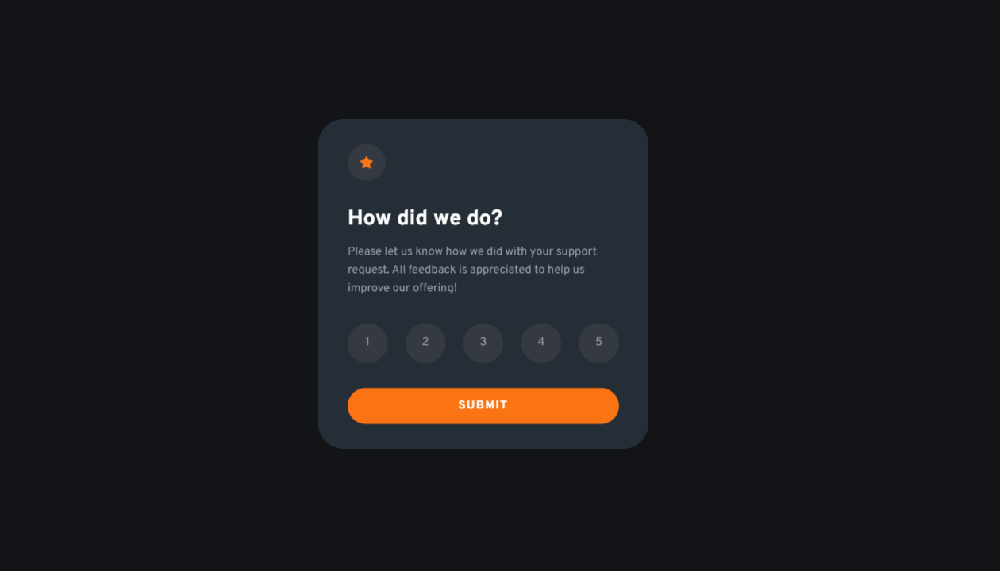

# Welcome! 👋

**"Thanks for checking out this front-end coding challenge."**

# Frontend Mentor - Interactive rating component solution

- Implemented with HTML & Css & Vanilla JavaScript.

## Table of contents

- [Overview](#overview)
  - [The challenge](#the-challenge)
  - [Screenshot](#screenshot)
  - [Links](#links)
- [My process](#my-process)
  - [Built with](#built-with)
  - [What I learned](#what-i-learned)
  - [Continued development](#continued-development)
  - [Useful resources](#useful-resources)
- [Author](#author)
- [Acknowledgments](#acknowledgments)

## Overview

### The challenge

Users should be able to:

- View the optimal layout for the app depending on their device's screen size
- See hover states for all interactive elements on the page
- Select and submit a number rating
- See the "Thank you" card state after submitting a rating

### Screenshot

### Links

- Solution URL: [Click to check my solution at Frontend Mentor](https://www.frontendmentor.io/solutions/interactive-rating-component-solution-with-3d-animation-and-vanilla-js-0TJZTmr77j)
- Live Site URL: [Click to check the live site](https://cgm-thanhtike.github.io/Interactive-rating-component/)

## My process

- I'm focusing on practicing 3D animation, particularly the creation of card rotation animations with a 3D perspective in this challenge.

- Additionally, I've implemented error handling using JavaScript:

- Now, if you attempt to submit without selecting a rating, an error message will be displayed.

- Also, if you inspect and modify the rating value to be less than 0 or greater than 5, an error message will appear.

### Built with

- Semantic HTML5 markup
- CSS custom properties
- Flexbox
- Vanilla JavaScript

### What I learned

- I learned about 3d perspective animation.
- DOM manipulation with Js
- Error Handling with Js

## Author

- Website - [My git-hub profile](https://github.com/CGM-ThanHtike)
- Frontend Mentor - [My Frontend Mentor profile](https://www.frontendmentor.io/profile/CGM-ThanHtike)

**Thank you all!** 🚀